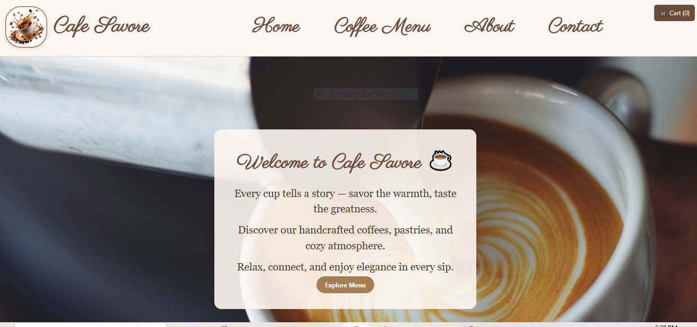
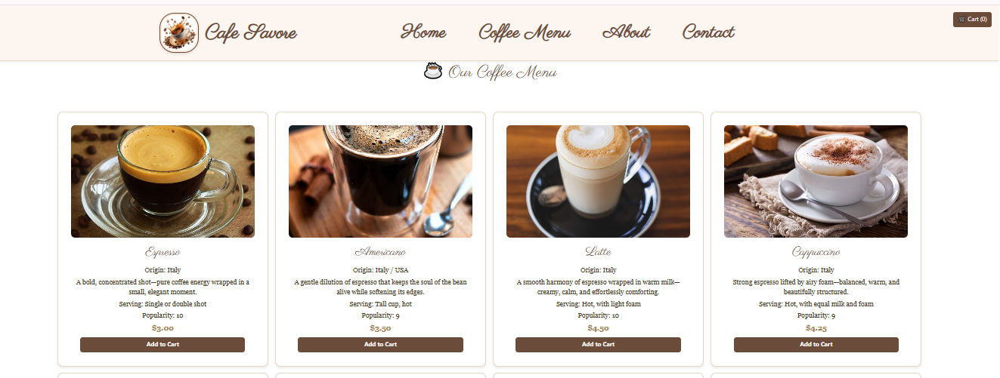
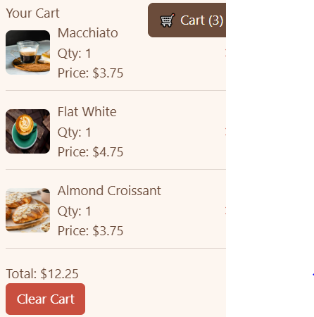
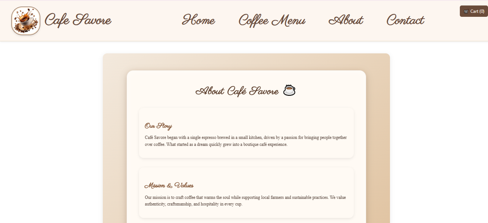
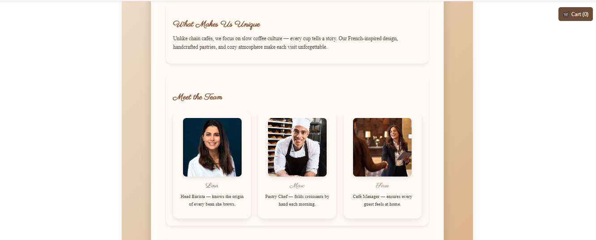
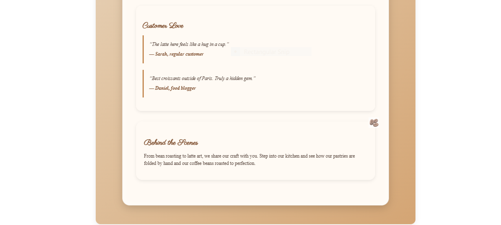

# Coffee Shop App

## Project Description
A boutique café-themed React web application that showcases:  
- A dynamic coffee and pastry menu with images and descriptions  
- Shopping cart functionality  
- Elegant navigation bar and footer  
- Background changer for a lively UI  
- About and Contact pages with team bios and café story  

The goal is to combine technical robustness with French-inspired design elegance, creating a polished and professional café website.

---

##  Setup Instructions

### Prerequisites
- Install [Node.js](https://nodejs.org/) (which includes npm).  
  Recommended version: Node.js 18 or later.

---

# Clone the repository
git clone https://github.com/Aleen-coder/coffee-shop.git

# Navigate into the project folder
cd coffee-shop

# Install dependencies
npm install

# Run the app locally
npm start

# Build for production
npm run build

#Live demo:
https://Aleen-coder.github.io/coffee-shop

## Screenshots of the UI

### Home Page

### Menu Page

### Cart Page

### About Page

