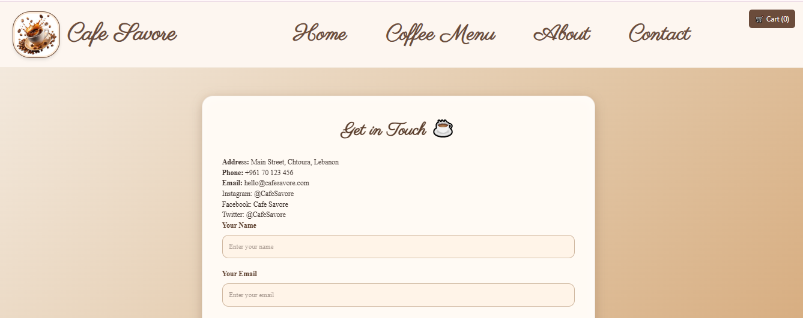
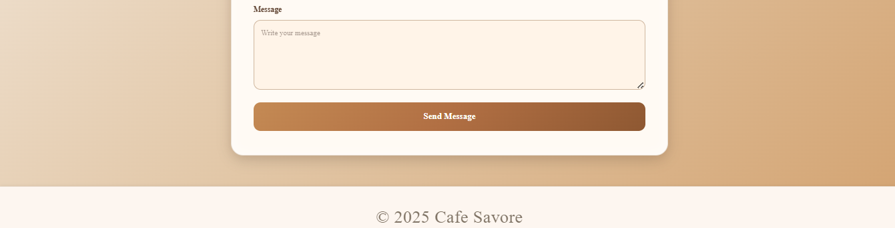

# Coffee Shop App

## Project Description
Coffee Shop App is a full‑stack café‑themed web application built with **React (frontend)** and **Express + MySQL (backend)**.
Features include:
- A dynamic coffee and pastry menu with images and descriptions  
- Shopping cart functionality  with checkout flow
- Elegant navigation bar and footer  
- Background changer for a lively UI
- About and Contact pages with team bios and café story
- Backend API with product, cart, and order routes
- MySQL database integration (Railway for production, phpMyAdmin for local demo)

The goal is to combine technical robustness with French-inspired design elegance, creating a polished and professional café website.

---

##  Setup Instructions

### Prerequisites
- Install [Node.js](https://nodejs.org/) (which includes npm).  
  Recommended version: Node.js 18 or later.
- Install MySQL locally (e.g. via XAMPP/WAMP/MAMP) or use Railway’s cloud database
- Git installed for cloning the repository
---

## Clone the repository
git clone https://github.com/Aleen-coder/coffee-shop.git

## Frontend Setup (React)

### Navigate into the project folder
cd coffee-shop

### Install dependencies
npm install

### Local development:
Create .env.local in the frontend folder:
.env.local:
REACT_APP_API_URL=http://localhost:5000

### Run the app locally
npm start

## Production (Vercel):
Set environment variable in Vercel dashboard:
REACT_APP_API_URL=https://coffee-shop-production-e224.up.railway.app

## Build for production
npm run build

##Live demo:
https://Aleen-coder.github.io/coffee-shop

## Backend Setup (Express + MySQL)
### Navigate into the project folder
cd Backend
### Install dependencies
npm install

### Local development:
Create .env.local in the backend folder:
.env.local:
MYSQLDATABASE=coffee-shop
MYSQLHOST=localhost
MYSQLPORT=3306
MYSQLUSER=root
MYSQLPASSWORD=

### Run:
npm start
Backend runs at: http://localhost:5000

## Production (Railway):
Set environment variables in Railway dashboard:
MYSQLDATABASE=railway
MYSQLHOST=metro.proxy.rlwy.net
MYSQLPORT=14527
MYSQLUSER=root
MYSQLPASSWORD=cfEDGeFkDkpnMLCdEYBExtfRPcAMtVKA

## Web Project/
  Backend/
    server.js
    db.js
    package.json
    .env        # Railway DB credentials
    .env.local  # Local phpMyAdmin DB credentials
  coffee-shop/
    src/
    package.json
    .env        # Production API URL (Vercel)
    .env.local  # Local API URL

## Screenshots of the UI

### Home Page

### Menu Page

### Cart Page

### About Page

### Contact Page

